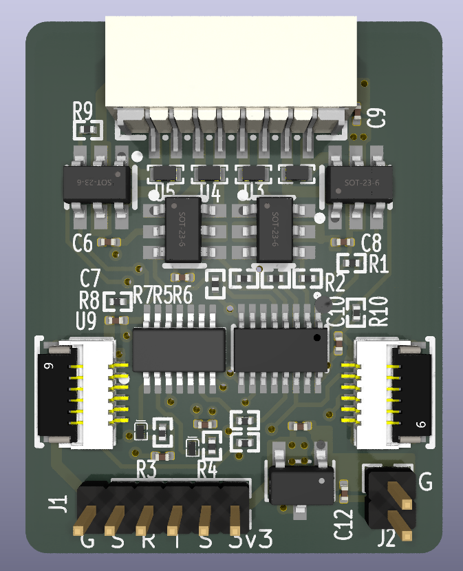
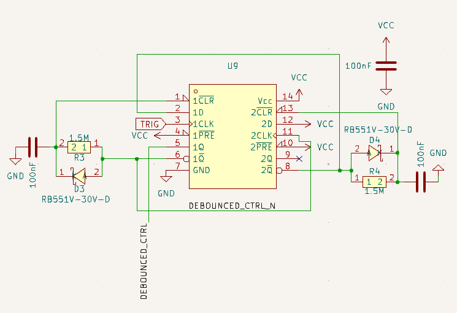

# Latching_relay_controller
A simple latching relay controller pcb designed with low-power and space-saving in mind.

This design employs a SN74HCS74 (dual D-latch) as a fixed period pulse generator, which drives the enable pin of a SN74HC595 (tri-state shift register) to generate control signals with pulse length no longer than 100ms (can be adjusted accordingly using t=RC) and a cool down of no shorter than 100ms. The output is then fed into a couple of HBridge drivers (SSP8023D) that drives the latching relays. Currently, HongFa's HF3F-L is being used as the target latching relay, and any other relays like that of FANHAR's FH44L which boasts relatively low-power consumption is also viable. The fact that the latter requires an order of magnitude less drive time (10ms) makes for an attractive options for those looking to squeeze the power consumption even more. 

Another thing worth mentioning is that, multiple instances of this board can be daisy chained together thanks to the shift register, thus increasing the extensibility of the project itself.

## Why use a hardware controlled circuit? Doesn't a MCU do that just fine?
Well, I knew this is overkill in the first place, but i was curious to see how robust it could get compared to software implementations. Nevertheless, this is my first attempt at building a pcb and designing a useful circuit that serves pratical use for my dorm's power extension which is often hard to reach. So bear with me on that.

# PCB Overview

# Todos
- Shrink the pcb dimensions even more
- Revamp the design with more easily accessible and cheaper components
- Well, you tell me ;)
